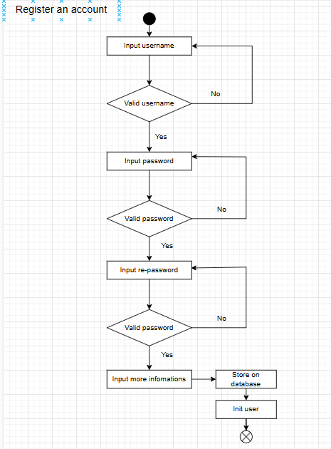

# Sơ đồ Hoạt động (Activity Diagram)

Tài liệu này mô tả quy trình đăng ký tài khoản người dùng được triển khai trong dự án. Quy trình được thiết kế tuần tự, đảm bảo tính hợp lệ và an toàn của thông tin người dùng trước khi lưu vào hệ thống.

## 1: Đăng ký tài khoản

### Các bước thực hiện

1. **Nhập tên người dùng (username)**
   - Người dùng nhập tên tài khoản mong muốn.
   - Hệ thống kiểm tra tính hợp lệ của tên (định dạng, độ dài, trùng lặp...).
   - Nếu không hợp lệ, yêu cầu nhập lại.

2. **Nhập mật khẩu**
   - Người dùng nhập mật khẩu.
   - Mật khẩu được kiểm tra độ mạnh (độ dài, ký tự đặc biệt, v.v.).
   - Nếu không hợp lệ, yêu cầu nhập lại.

3. **Nhập lại mật khẩu (re-password)**
   - Người dùng nhập lại mật khẩu để xác nhận.
   - Hệ thống kiểm tra trùng khớp với mật khẩu đã nhập trước đó.
   - Nếu không trùng, yêu cầu nhập lại.

4. **Nhập thêm thông tin**
   - Sau khi xác nhận mật khẩu thành công, người dùng sẽ điền các thông tin bổ sung như họ tên, email, số điện thoại...

5. **Lưu vào cơ sở dữ liệu**
   - Sau khi tất cả thông tin hợp lệ, hệ thống tiến hành lưu dữ liệu vào CSDL.

6. **Khởi tạo người dùng**
   - Hệ thống tạo tài khoản người dùng mới và sẵn sàng để đăng nhập, sử dụng.

## Ghi chú

- Sẽ bổ sung thêm và sửa lại chi tiết hơn @@@

___
