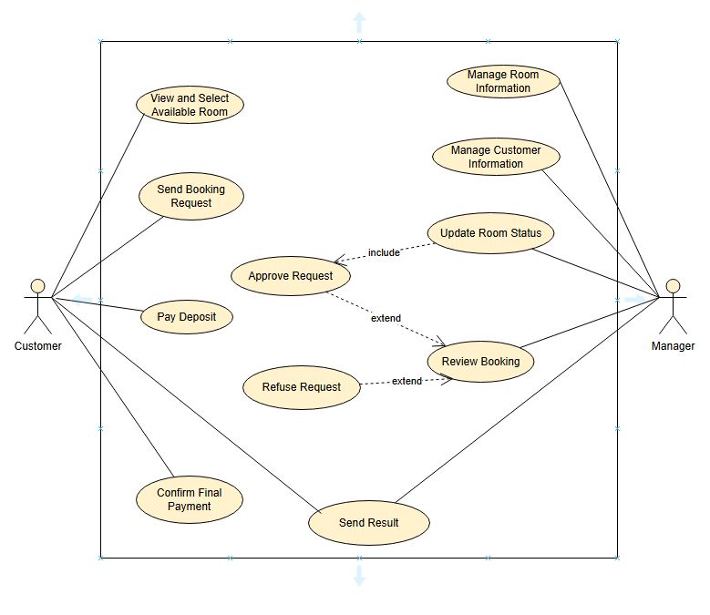

# 1. Sơ đồ use case cho Đặt phòng

## 1.1 . Sơ đồ usecase

## 1.2. Đặc tả use case

# Use Case: UC000 - Đặt phòng

## 1. Mã use case
**UC000**

## 2. Tên use case
**Đặt phòng**

## 3. Tác nhân
- **Customer**, **Manager**

## 4. Mục đích sử dụng
Cho phép khách hàng đặt phòng thông qua hệ thống từ bước chọn phòng, gửi yêu cầu, thanh toán cọc và hoàn tất thanh toán.

## 5. Sự kiện kích hoạt
Khách hàng chọn chức năng **"Đặt phòng"** trên hệ thống sau khi đăng nhập.

## 6. Điều kiện tiên quyết
- Khách hàng đã đăng nhập hệ thống.
- Hệ thống có phòng trống trong cơ sở dữ liệu.

## 7. Luồng sự kiện chính (Thành công)
1. Khách hàng đăng nhập hệ thống.
2. Khách hàng chọn chức năng **“Xem và chọn phòng trống”**.
3. Hệ thống hiển thị danh sách phòng trống với thông tin chi tiết.
4. Khách hàng chọn phòng phù hợp và xác nhận đặt.
5. Hệ thống ghi nhận yêu cầu, khách hàng nhập thông tin bổ sung (ngày nhận, ngày trả, yêu cầu đặc biệt).
6. Khách hàng gửi yêu cầu đặt phòng.
7. Hệ thống gửi yêu cầu đến quản lý.
8. Quản lý kiểm tra thông tin khách hàng và yêu cầu.
9. Quản lý phê duyệt yêu cầu.
10. Hệ thống cập nhật trạng thái phòng là **"Đã phê duyệt"**.
11. Hệ thống gửi thông báo phê duyệt cho khách hàng.
12. Khách hàng thanh toán tiền cọc.
13. Hệ thống xác nhận thanh toán thành công.
14. Khách hàng thanh toán số tiền còn lại trước ngày nhận phòng.
15. Hệ thống xác nhận hoàn tất đặt phòng.

## 8. Luồng sự kiện thay thế

### 8.1 Yêu cầu bị từ chối
- Quản lý từ chối yêu cầu đặt phòng.
- Hệ thống gửi thông báo từ chối đến khách hàng.
- Luồng kết thúc.

### 8.2 Không thanh toán cọc
- Khách hàng không thanh toán trong thời hạn quy định.
- Hệ thống hủy yêu cầu và cập nhật trạng thái phòng về **“Trống”**.
- Luồng kết thúc.

## 9. Hậu điều kiện
- **Thành công:** Yêu cầu được lưu, phòng được cập nhật, thanh toán hoàn tất.
- **Thất bại:** Yêu cầu bị từ chối hoặc bị hủy, trạng thái phòng không thay đổi.
