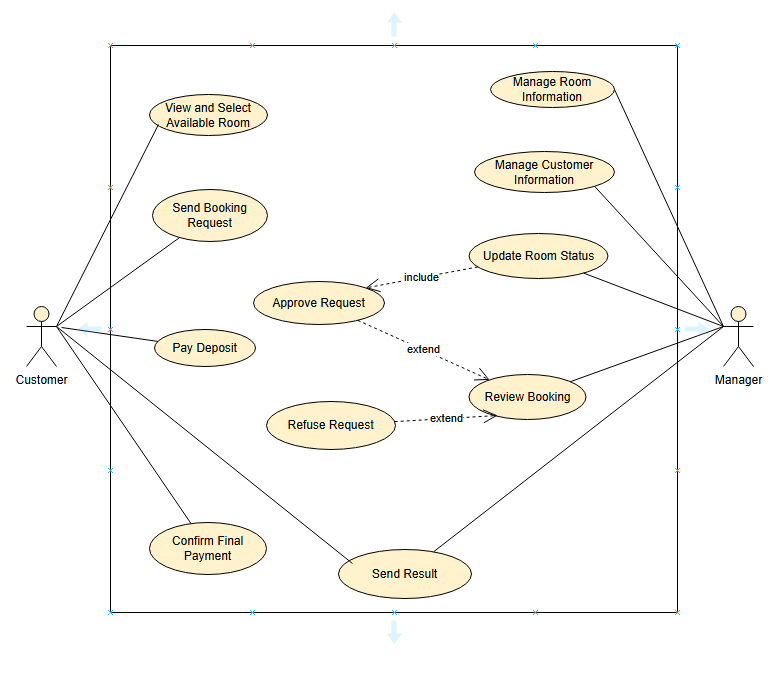

# 1. Sơ đồ use case cho Đặt phòng

## 1.1 . Sơ đồ usecase

## 1.2. Đặc tả use case

Đặc tả use case UC001 **"View and Select Available Room"**

Mã use case | UC001
--- | ---
Tên use case | View and Select Available Room
Tác nhân | Cư dân
Mục đích sử dụng | Cư dân xem và chọn phòng trống để đặt
Sự kiện kích hoạt | Cư dân chọn chức năng xem và chọn phòng trên hệ thống
Điều kiện tiên quyết | Không
Luồng sự kiện chính (Thành công) | 1. Cư dân đăng nhập vào hệ thống đặt phòng. 2. Cư dân chọn chức năng "View and Select Available Room". 3. Hệ thống hiển thị danh sách các phòng trống (bao gồm thông tin như số phòng, giá, tiện nghi). 4. Cư dân chọn phòng phù hợp. 5. Hệ thống ghi nhận lựa chọn của cư dân. 6. Hệ thống hiển thị thông tin xác nhận lựa chọn phòng.
Luồng sự kiện thay thế | 3a. Hệ thống báo lỗi: Không có phòng trống nếu không tìm thấy phòng nào khả dụng.
Hậu điều kiện | Hệ thống hiển thị giao diện xem để cư dân kiểm tra và xác nhận việc chọn phòng

---

Đặc tả use case UC002 **"Send Booking Request"**

Mã use case | UC002
--- | ---
Tên use case | Send Booking Request
Tác nhân | Cư dân
Mục đích sử dụng | Cư dân gửi yêu cầu đặt phòng
Sự kiện kích hoạt | Cư dân chọn chức năng gửi yêu cầu đặt phòng trên hệ thống
Điều kiện tiên quyết | Cư dân đã chọn phòng thông qua "View and Select Available Room"
Luồng sự kiện chính (Thành công) | 1. Cư dân đăng nhập vào hệ thống đặt phòng. 2. Cư dân chọn chức năng "Send Booking Request". 3. Hệ thống hiển thị thông tin phòng đã chọn (bao gồm giá, thời gian đặt). 4. Cư dân nhập thông tin bổ sung (nếu cần, ví dụ: ngày nhận phòng, ngày trả phòng). 5. Cư dân xác nhận gửi yêu cầu đặt phòng. 6. Hệ thống ghi nhận yêu cầu và gửi thông báo cho quản lý. 7. Hệ thống hiển thị xác nhận gửi yêu cầu cho cư dân.
Luồng sự kiện thay thế | 4a. Hệ thống báo lỗi: Cần nhập các trường bắt buộc nếu cư dân không điền đầy đủ thông tin.
Hậu điều kiện | Hệ thống hiển thị giao diện xem để cư dân kiểm tra và xác nhận việc gửi yêu cầu đặt phòng

---

Đặc tả use case UC003 **"Approve Request"**

Mã use case | UC003
--- | ---
Tên use case | Approve Request
Tác nhân | Quản lý
Mục đích sử dụng | Quản lý phê duyệt yêu cầu đặt phòng từ cư dân
Sự kiện kích hoạt | Quản lý chọn chức năng phê duyệt yêu cầu trên hệ thống
Điều kiện tiên quyết | Có yêu cầu đặt phòng từ cư dân đã được gửi
Luồng sự kiện chính (Thành công) | 1. Quản lý đăng nhập vào hệ thống quản lý đặt phòng. 2. Quản lý chọn chức năng "Approve Request". 3. Hệ thống hiển thị danh sách các yêu cầu đặt phòng chưa xử lý (bao gồm "Check Customer Information"). 4. Quản lý chọn yêu cầu cần phê duyệt. 5. Quản lý xem xét thông tin yêu cầu (phòng, thời gian, thông tin cư dân). 6. Quản lý xác nhận phê duyệt yêu cầu. 7. Hệ thống cập nhật trạng thái đặt phòng thành "Đã phê duyệt". 8. Hệ thống gửi thông báo cho cư dân: "Yêu cầu đặt phòng của bạn đã được phê duyệt.".
Luồng sự kiện thay thế | 6a. Hệ thống báo lỗi: Cần nhập các trường bắt buộc nếu thông tin phê duyệt không đầy đủ.
Hậu điều kiện | Hệ thống hiển thị giao diện xem để quản lý kiểm tra và xác nhận việc phê duyệt yêu cầu

---

Đặc tả use case UC004 **"Cancel Booking"**

Mã use case | UC004
--- | ---
Tên use case | Cancel Booking
Tác nhân | Cư dân
Mục đích sử dụng | Cư dân hủy đặt phòng đã gửi
Sự kiện kích hoạt | Cư dân chọn chức năng hủy đặt phòng trên hệ thống
Điều kiện tiên quyết | Cư dân đã có yêu cầu đặt phòng được phê duyệt hoặc đang chờ xử lý
Luồng sự kiện chính (Thành công) | 1. Cư dân đăng nhập vào hệ thống đặt phòng. 2. Cư dân chọn chức năng "Cancel Booking". 3. Hệ thống hiển thị danh sách đặt phòng của cư dân (bao gồm trạng thái: chờ phê duyệt, đã phê duyệt). 4. Cư dân chọn đặt phòng cần hủy. 5. Cư dân xác nhận hủy đặt phòng. 6. Hệ thống cập nhật trạng thái đặt phòng thành "Đã hủy". 7. Hệ thống gửi thông báo cho quản lý: "Cư dân [Tên] đã hủy đặt phòng [Số Phòng].". 8. Hệ thống hiển thị xác nhận hủy cho cư dân.
Luồng sự kiện thay thế | 5a. Hệ thống báo lỗi: Cần nhập các trường bắt buộc nếu thông tin hủy không đầy đủ. 5b. Nếu hủy dẫn đến yêu cầu hoàn tiền (mở rộng "Request Refund"), hệ thống chuyển sang luồng xử lý hoàn tiền.
Hậu điều kiện | Hệ thống hiển thị giao diện xem để cư dân kiểm tra và xác nhận việc hủy đặt phòng