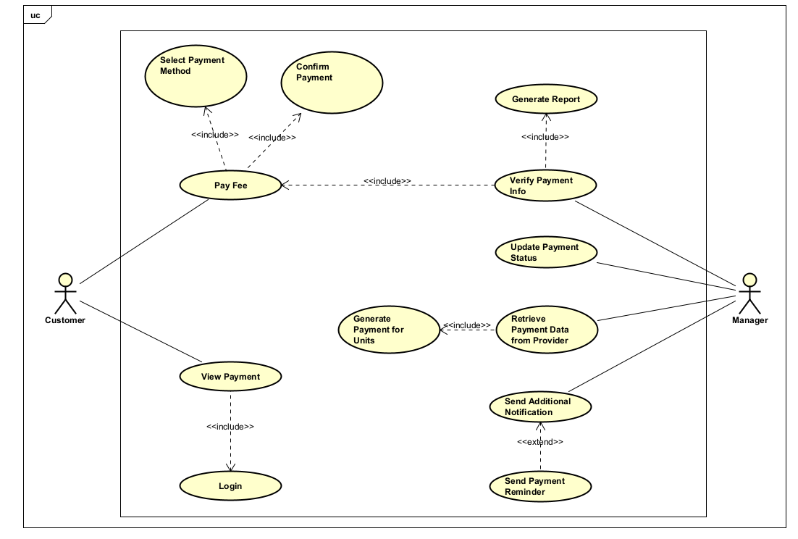

# 2. Sơ đồ Usecase cho thanh toán khoản phí

## 2.1. Sơ đồ usecase

## 2.2. Đặc tả cho usecase
### Đặc tả Use Case UC001 - **Pay Fee**

| Mã use case       | UC001                                 |
|-------------------|----------------------------------------|
| Tên use case      | Pay Fee                                |
| Tác nhân          | Cư dân                                 |
| Mục đích sử dụng  | Cư dân thanh toán phí chung cư         |
| Sự kiện kích hoạt | Cư dân chọn chức năng thanh toán phí   |
| Điều kiện tiên quyết | Không                               |
| Luồng sự kiện chính (Thành công) |  1. Cư dân đăng nhập vào hệ thống quản lý chung cư.    2. Cư dân chọn chức năng "Thanh Toán Phí".    3. Hệ thống hiển thị thông tin thanh toán (bao gồm "Xem Thông Tin Thanh Toán").   4. Cư dân chọn khoản phí cần thanh toán.    5. Cư dân chọn phương thức thanh toán (thẻ ngân hàng, ví điện tử,...).    6. Cư dân nhập thông tin thanh toán và xác nhận giao dịch.    7. Hệ thống xử lý thanh toán và cập nhật trạng thái phí.   8. Hệ thống hiển thị xác nhận thanh toán cho cư dân.  
| Hậu điều kiện     | Giao dịch được ghi nhận, cư dân có thể kiểm tra lại trạng thái thanh toán. |

---

### Đặc tả Use Case UC002 - **Generate Payment for Units**

| Mã use case       | UC002                                              |
|-------------------|-----------------------------------------------------|
| Tên use case      | Generate Payment for Units                          |
| Tác nhân          | Ban quản lý                                         |
| Mục đích sử dụng  | Tạo danh sách khoản phí theo từng căn hộ/cư dân     |
| Sự kiện kích hoạt | Ban quản lý chọn chức năng tạo thanh toán           |
| Điều kiện tiên quyết | Đã lấy dữ liệu thanh toán từ nhà cung cấp       |
| Luồng sự kiện chính (Thành công) | 1. Ban quản lý đăng nhập vào hệ thống.   2. Ban quản lý chọn chức năng "Tạo Thanh Toán".  3. Hệ thống truy xuất dữ liệu thanh toán đã lưu từ nhà cung cấp.   4. Hệ thống xử lý và ánh xạ dữ liệu tương ứng với từng hộ/cư dân.   5. Hệ thống tạo các khoản phí phải đóng cho từng căn hộ.   6. Dữ liệu được lưu vào cơ sở dữ liệu.   7. Hệ thống thông báo hoàn tất việc tạo thanh toán.  
| Hậu điều kiện     | Danh sách khoản phí đã được khởi tạo, sẵn sàng hiển thị cho cư dân. |

---

### Đặc tả Use Case UC003 - **Handle Complaint**

| Mã use case       | UC003                                               |
|-------------------|------------------------------------------------------|
| Tên use case      | Handle Complaint                                     |
| Tác nhân          | Ban quản lý                                          |
| Mục đích sử dụng  | Xử lý khiếu nại từ cư dân liên quan đến thanh toán  |
| Sự kiện kích hoạt | Quản lý chọn chức năng xử lý khiếu nại trên hệ thống|
| Điều kiện tiên quyết | Không                                            |
| Luồng sự kiện chính (Thành công) |  1. Quản lý đăng nhập vào hệ thống.   2. Chọn chức năng "Xử Lý Khiếu Nại".   3. Hệ thống hiển thị danh sách khiếu nại chưa xử lý.   4. Quản lý chọn một khiếu nại để xử lý.   5. Hệ thống hiển thị chi tiết khiếu nại (tên cư dân, nội dung, hóa đơn liên quan).  6. Quản lý xác minh thông tin liên quan (hóa đơn, lịch sử thanh toán).  7. Thực hiện hành động xử lý (cập nhật dữ liệu, phản hồi, giải thích...) 8. Cập nhật trạng thái khiếu nại (Đã Giải Quyết, Đang Xử Lý, Chuyển Tiếp).   9. Hệ thống thông báo cho cư dân về kết quả xử lý.  
| Hậu điều kiện     | Khiếu nại được cập nhật trạng thái, lưu vào hệ thống, cư dân nhận được thông báo phản hồi. |
