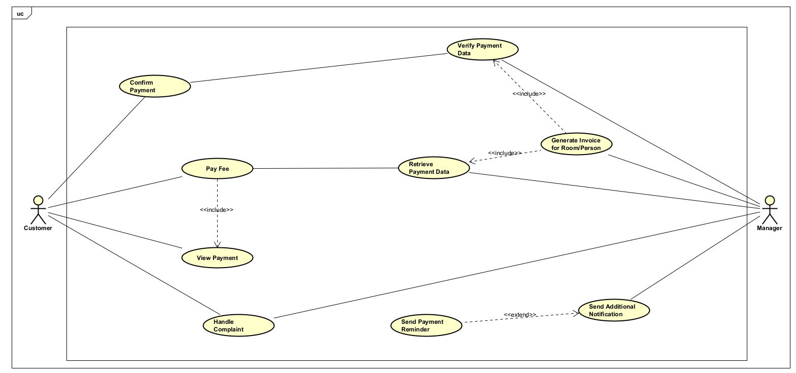

# 2. Sơ đồ Usecase cho thanh toán khoản phí

## 2.1. Sơ đồ usecase

## 2.2. Đặc tả cho usecase
Đặc tả use case UC001 **"Pay Fee"**

Mã use case | UC001
--- | ---
Tên use case | Pay Fee
Tác nhân | Cư dân
Mục đích sử dụng | Cư dân thanh toán phí chung cư
Sự kiện kích hoạt | Cư dân chọn chức năng thanh toán phí trên hệ thống
Điều kiện tiên quyết | Không
Luồng sự kiện chính (Thành công) | 1. Cư dân đăng nhập vào hệ thống quản lý chung cư. 2. Cư dân chọn chức năng "Thanh Toán Phí". 3. Hệ thống hiển thị thông tin thanh toán (bao gồm "Xem Thông Tin Thanh Toán"). 4. Cư dân chọn khoản phí cần thanh toán. 5. Cư dân chọn phương thức thanh toán (ví dụ: thẻ ngân hàng, ví điện tử). 6. Cư dân nhập thông tin thanh toán và xác nhận giao dịch. 7. Hệ thống xử lý thanh toán và cập nhật trạng thái phí. 8. Hệ thống hiển thị xác nhận thanh toán cho cư dân.
Hậu điều kiện | Hệ thống hiển thị giao diện xem để cư dân kiểm tra và xác nhận việc thanh toán

---

Đặc tả use case UC002 **"Generate Invoice for Room/Person"**

Mã use case | UC002
--- | ---
Tên use case | Generate Invoice for Room/Person
Tác nhân | Quản lý
Mục đích sử dụng | Quản lý tạo hóa đơn phí cho một phòng hoặc cư dân
Sự kiện kích hoạt | Quản lý chọn chức năng tạo hóa đơn trên hệ thống
Điều kiện tiên quyết | Không
Luồng sự kiện chính (Thành công) | 1. Quản lý đăng nhập vào hệ thống quản lý chung cư. 2. Quản lý chọn chức năng "Tạo Hóa Đơn cho Phòng/Người". 3. Hệ thống truy xuất dữ liệu thanh toán (bao gồm "Truy Xuất Dữ Liệu Thanh Toán"). 4. Hệ thống hiển thị dữ liệu thanh toán trước đó (hoặc thông báo không có dữ liệu). 5. Quản lý nhập thông tin hóa đơn (loại phí, số tiền, ngày đến hạn). 6. Hệ thống xác minh thông tin hóa đơn. 7. Hệ thống tạo và lưu hóa đơn. 8. Hệ thống hiển thị xác nhận cho quản lý.
Hậu điều kiện | Hệ thống hiển thị giao diện xem để quản lý kiểm tra và xác nhận việc tạo hóa đơn

---

Đặc tả use case UC003 **"Handle Complaint"**

Mã use case | UC003
--- | ---
Tên use case | Handle Complaint
Tác nhân | Quản lý
Mục đích sử dụng | Quản lý xử lý khiếu nại từ cư dân liên quan đến phí hoặc thanh toán
Sự kiện kích hoạt | Quản lý chọn chức năng xử lý khiếu nại trên hệ thống
Điều kiện tiên quyết | Không
Luồng sự kiện chính (Thành công) | 1. Quản lý đăng nhập vào hệ thống quản lý chung cư. 2. Quản lý chọn chức năng "Xử Lý Khiếu Nại". 3. Hệ thống hiển thị danh sách khiếu nại chưa xử lý. 4. Quản lý chọn khiếu nại cần xử lý. 5. Hệ thống hiển thị chi tiết khiếu nại (tên cư dân, nội dung, hóa đơn liên quan). 6. Quản lý xác minh thông tin (kiểm tra hóa đơn, lịch sử thanh toán). 7. Quản lý thực hiện hành động giải quyết (sửa hóa đơn, giải thích, v.v.). 8. Quản lý cập nhật trạng thái khiếu nại (Đã Giải Quyết, Chuyển Tiếp). 9. Hệ thống thông báo cho cư dân về kết quả xử lý.
Hậu điều kiện | Hệ thống hiển thị giao diện xem để quản lý kiểm tra và xác nhận việc xử lý khiếu nại