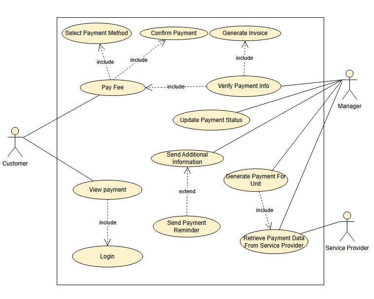

# 2. Sơ đồ Usecase cho thanh toán khoản phí

## 2.1. Sơ đồ usecase

## 2.2. Đặc tả cho Use Case: UC001 - Thanh toán khoản phí

## 1. Mã use case
**UC001**

## 2. Tên use case
**Thanh toán khoản phí**

## 3. Tác nhân
- **Khách hàng (Customer)**
- **Quản lý (Manager)**
- **Nhà cung cấp dịch vụ (Service Provider)**

## 4. Mục đích sử dụng
Cho phép khách hàng thực hiện thanh toán phí dịch vụ, hệ thống xác minh thông tin thanh toán và cập nhật trạng thái thanh toán.

## 5. Sự kiện kích hoạt
Khách hàng chọn chức năng **"Pay Fee"** trong hệ thống sau khi đăng nhập.

## 6. Điều kiện tiên quyết
- Khách hàng đã đăng nhập vào hệ thống.
- Khoản phí phải trả đã được tạo và có thông tin xác minh.

## 7. Luồng sự kiện chính (Thành công)
1. Khách hàng đăng nhập vào hệ thống.
2. Khách hàng chọn chức năng **“Pay Fee”**.
3. Hệ thống yêu cầu khách hàng **chọn phương thức thanh toán**.
4. Khách hàng chọn phương thức phù hợp (thẻ, ví điện tử...).
5. Khách hàng **xác nhận thanh toán**.
6. Hệ thống thực hiện **xác minh thông tin thanh toán** (`Verify Payment Info`).
7. Hệ thống gọi tới **nhà cung cấp dịch vụ** để **lấy dữ liệu thanh toán** (`Retrieve Payment Data From Service Provider`).
8. Nhà cung cấp dịch vụ phản hồi kết quả giao dịch.
9. Hệ thống **tạo hóa đơn** (`Generate Invoice`).
10. Hệ thống **cập nhật trạng thái thanh toán** (`Update Payment Status`).
11. Quản lý có thể truy cập để kiểm tra trạng thái thanh toán.

## 8. Luồng sự kiện thay thế

### 8.1 Thông tin thanh toán chưa hợp lệ
- Hệ thống yêu cầu khách hàng cung cấp thêm thông tin (`Send Additional Information`).
- Sau khi bổ sung, quay lại bước xác minh (bước 6).

### 8.2 Khách hàng không xác nhận thanh toán
- Sau thời hạn thanh toán, hệ thống tự động **gửi nhắc nhở** (`Send Payment Reminder`).
- Nếu vẫn không thực hiện, trạng thái giao dịch giữ nguyên là **“Chưa thanh toán”**.

## 9. Hậu điều kiện
- **Thành công:** Trạng thái được cập nhật là **“Đã thanh toán”**, hóa đơn được tạo, thông tin được lưu trữ.
- **Thất bại:** Giao dịch bị hủy hoặc giữ ở trạng thái chờ xử lý, cần xác minh lại sau.
