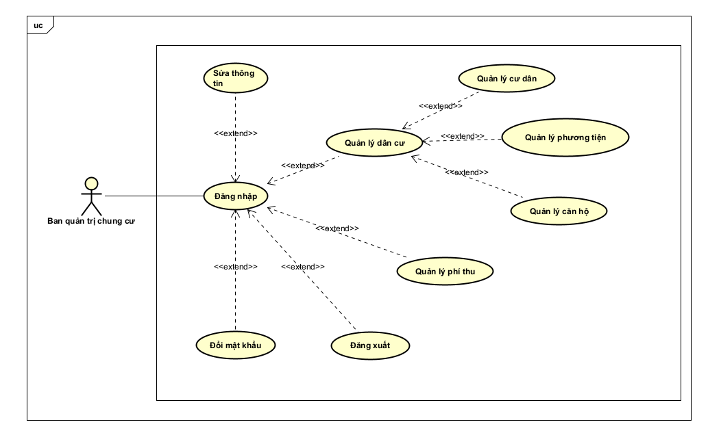

<h1> Biểu đồ use case  
 ==================== </h1>

## 1. Biểu đồ use case tổng quan
### 1.1. Giới thiệu chung

- Tác nhân

| STT | Tên tác nhân | Mô tả tác nhân                                                |
| --- | ------------ | ------------------------------------------------------------- |
| 1   | Ban quản trị | Quản lý cư dân, phương tiện, khoản phí thu, danh sách phí thu |

- Use case

| STT | Mã use case | Tên use case  | Mô tả Usecase                                       | Tác nhân tương tác    | Độ phức tạp |
| --- | ----------- | ------------- | --------------------------------------------------- | --------------------- | ----------- |
| 1   | UC01        | Đăng nhập     | Cho phép người dùng đăng nhập vào hệ thống          | Ban quản trị chung cư |             |
| 2   | UC02        | Đăng xuất     | Cho phép người dùng đăng xuất khỏi hệ thống         | Ban quản trị chung cư |             |
| 3   | UC03        | Sửa Thông tin | Cho phép người dùng chỉnh sửa thông tin cá nhân     | Ban quản trị chung cư |             |
| 4   | UC04        | Đổi mật khẩu  | Cho phép người dùng đổi mật khẩu đăng nhập hệ thống | Ban quản trị chung cư |             |

### 1.2. Biểu đồ use case

#### 1.2.1. Biểu đồ use case tổng quát

    

